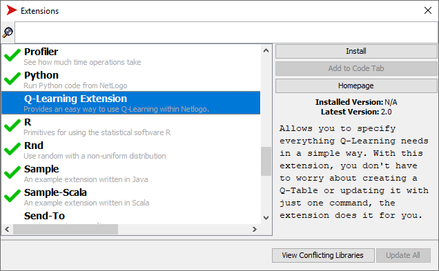

# Q-Learning Netlogo Extension

This extension provides an easy way to use [Q-Learning](https://en.wikipedia.org/wiki/Q-learning) within Netlogo.

**Table of Contents**
* [Installation](#installation)
* [Usage](#usage)
* [Example](#example)
* [Team](#team)


## Installation
Extension Manager is a tool for discovering and managing extensions. It can be accessed through the "Extensions ..." option in the Tools menu.

On the left side of the Extension Manager window, as shown in the image below, there is a list of all available extensions. At the top of the window, there is a text box that can be used to search for an extension by its name.



When an extension is selected, the text on the right side provides a detailed description of the extension. Above the description, there are buttons for various operations, such as installation, update, and uninstallation. The "Add to code tab" button will add the extension to your model's list of extensions.

## Usage

The extension provides a set of primitives to setup and execute the Q-Learning algorithm.

that must be executed during the **setup**, and another set of primitives that must be executed during the **execution** of your simulation.

### Q-Learning Setup Primitives
The **setup** primitives must be executed during the set up of your simulation. In NetLogo this is often done in a `setup` procedure.

It is **extremely recommended** to execute a `clear-all` in the setup procedure. If do not execute it, things will get duplicated and the extension may not work.

Then in the `setup` procedure you must execute an `ask` to the breed you want to be the learners. Inside this `ask` you can run the following primitives:

---

#### `qlearningextension:state-def ["var1" "varN"]`

Used to define the **state representation** of your learner agent.
This primitive receives a list containing variable names that the agent that did the `ask` owns. **Before running any of the primitives below you must first run this primitive**.

---

#### `qlearningextension:state-def ["var1" "varN"] reporter`

Acts exactly the previous primitive, except that it admits an additional `reporter` argument. This primitive is useful when you need to add values to the state definition that are not agent variables.

The `reporter` argument must be a reporter that returns a `string`.  Every time the extension is about to generate a state, this reporter will be called and its return will be added to the state definition of that state.

---

#### `(qlearningextension:action [action1] [action2] [actionN])`
Used to define what **actions** the learner agent can perform.

The primitive receives as argument(s) the action(s) that the agent can perform. You can pass how many actions you want, **but they must be procedures not reporters**.  

Please notice (and do not forget to type) the parentheses encapsulating the primitive call and the brackets surrounding each action.

---

#### `learningextension:reward [rewardFunc]`

Used to define a **reporter** that will return a number with the **reward** for the **current state**.

---

#### `qlearningextension:end-episode [isEndState] resetEpisode`

This primitive should be used in **episodic** learning to reset the problem to its initial state by the end of an episode.

The `isEndState` argument must be a `reporter` that returns a boolean value to indicate whether the current state characterizes the end of an episode. The `resetEpisode` argument must be a `procedure` that resets the agent/environment to its initial state. This `resetEpisode` procedure is called automatically by the extension when `isEndState` returns `true`.

---

#### `qlearningextension:action-selection "policy" []`

Used to define the action selection policy.

The following two selection policies are provided:
- `random-normal`: selects an action at random according to the percentage passed as argument. For example, `qlearningextension:action-selection "random-normal" [0.8]` specifies that 80% of the actions will be selected at random;

- `e-greedy`: also selects an action according to the percentage passed as the first argument, but such percentage is decreased over time according to the second argument. For example, `qlearningextension:action-selection "e-greedy" [0.8 0.99995]` specifies that 80% of the actions will be selected at random, but after each episode this percentage is updated and its new value corresponds to the current value multiplied by the decrease rate.

In both cases the numeric arguments must be between 0 and 1.

---
#### `qlearningextension:action-selection-egreedy epsilonValue "type" decreaseValue`

Used to define the e-greedy action selection policy.

The following two selection types are provided:
- `rate`:  selects an action according to the percentage passed as the first argument, but such percentage is decreased over time according to the third argument. For example, `qlearningextension:action-selection-egreedy 0.8 "rate" 0.99995` specifies that 80% of the actions will be selected at random, but after each episode this percentage is updated and its new value corresponds to the current value multiplied by the decrease rate.

- `value`: selects an action according to the percentage passed as the first argument, but such percentage is changed to the third argument, which can be a report that updates the next epsilon value in the simulation, using its own decay rule. For example, `qlearningextension:action-selection-egreedy 0.8 "value" reportDecrease` specifies that reportDecrease will set the next epsilon value.

In both cases the numeric arguments must be between 0 and 1.

---
#### `qlearningextension:action-selection-random value`

Used to define the random normal action selection policy.

This policy selects an action at random according to the percentage passed as argument. For example, `qlearningextension:action-selection-random 0.8` specifies that 80% of the actions will be selected at random;

The numeric arguments must be between 0 and 1.

---
#### `qlearningextension:learning-rate learningRate`

Used to specify the learning rate. The `learningRate` argument must be a numeric value between 0 and 1.

---

#### `qlearningextension:discount-factor discountFactor`

Used to specify the discount factor. The  `discountFactor`argument must be a numeric value between 0 and 1.

---

### Q-Learning Execution Primitives

After setting up the extension, you must modify your simulation execution procedure (often called `go`) to activate the Q-Learning algorithm.

The following primitives are available to activate the Q-Learning algorithm. These must be executed within an `ask` block, to ask your learner agents to learn.

---

#### `qlearningextension:learning`

This primitives performs a Q-Learning step, which consist of the following sequence of steps:

1. select an action in the current state (according the selection policy) and performs it.
2. compute the reward.
3. update the Q-table.
4. check whether the new state is a final state, and if so, resets the agent/environment.

To help you in debugging your simulation, you can execute the learning primitive in a little different way: `(qlearningextension:learning true)`. Calling the primitive this way will make the extension print in the NetLogo console the following values: the old state and action, the old Q-list (the Q-table values of the old state), the new state, the observed reward, the expected reward of the new state and the new Q-list. Finally, if the action selection method uses epsilon, it will be printed with the other information.

Another way to debugging your simulations calling the `qlearningextension:get-qtable` primitive, this will return a string with the current Q-table.

---

#### `qlearningextension:learn`

Is responsible for learning the agents and updating the Q-Table to assist in the decision making of new actions. As well as the learning method, there is the possibility to use it in the following way `(qlearningextension:learn true)` for debugging

---

#### `qlearningextension:act`

It is responsible for making the action decision, as well as executing the action.

## Example

To make it easier to understand the usage of the extension we [implemented](cliff-walking.nlogo) the classic [cliff-waking problem](https://medium.com/@lgvaz/understanding-q-learning-the-cliff-walking-problem-80198921abbc) using the extension.

The environment of this simulation is a grid, in which a set of cells represents a precipice. The goal of an `Walker` agent is to learn how to get from the starting cell to the target cell without falling off the cliff. The agent can move up, down, right and left. An episode ends when the agent reaches the target cell or falls on the cliff. The reward when the agent falls on the cliff is -100; otherwise, your reward will be -1 for each cell you have passed.

> Q-Learning example: the Cliff Walking problem

```NetLogo
extensions[qlearningextension]

Breed[Walkers Walker]

to setup
  ask Walkers [
    qlearningextension:state-def ["xcor" "ycor"]
    (qlearningextension:actions [goUp] [goDown] [goLeft] [goRight])
    qlearningextension:reward [rewardFunc]
    qlearningextension:end-episode [isEndState] resetEpisode
    qlearningextension:action-selection "e-greedy" [0.5 0.08]
    qlearningextension:learning-rate 1
    qlearningextension:discount-factor 0.75
  ]
end


to go
  ask Walkers [
    qlearningextension:learning
    print(qlearningextension:get-qtable)
  ]
end
```

The `setup` is where the simulation is configured. The `ask` command block causes all `Walkers` agents to execute commands offered by the extension to configure the Q-Learning algorithm.

The command `qlearningextension: state-def` designates the representation of the state. It takes as an argument a list of agent attributes whose values characterize a state.

To specify the actions considered there is the command `qlearningextension: actions`. It uses as argument a list of NetLogo procedures implemented by the developer, each of which corresponds to an action that the agent can perform. In the Cliff Walking simulation, the procedures `goUp`, `goDown`, `goLeft` and `goRight` move the agent.

To discover the terminal states and end an episode, use the command `qlearningextension: end-episode` to specify the procedure that identifies a final state and the procedure that resets the simulation, both procedures will be implemented by the developer.

To specify the reward received by the agent whenever it acts, the extension provides the command `qlearningextension: reward` where the procedure that calculates and returns the reward value is informed.

The extension provides two stock selection policies: `random-normal` and `e-greedy`. They select an action at random with a certain probability. The difference is that in the `e-greedy` policy this probability is periodically reduced by a factor. To designate the stock selection policy, the extension provides the command `qlearningextension: action-selection`, which takes as an argument the name of the policy and a list of its parameters.

To specify the learning rate and the discount factor, the extension provides the commands `qlearningextension:learning-rate` and `qlearningextension:discount-factor`, respectively.

The `go` is where the behavior of the `Walkers` agents is implemented. It contains the command `qlearningextension: learning` that executes the learning, action selection and executes the action, then there is the print `(qlearningextension: get-qtable)` responsible for printing the Q-Table.

# Como Editar essa Extensão

Primeiramente, é necessário instalar o `IntelliJ`, a IDE oferecida pela JetBrains. Após a instalação, adiciona-se os plugins `Scala` e `SBT`. Feito isso, clone o repositório e abra-o no `IntelliJ` e tente gerar o build, então, adicione as dependências faltantes.

Para gerar o build, é necessário iniciar o console do `SBT`, encontrado na parte inferior da IDE, ao abrí-lo, basta clicar no símbolo de play. Quando carregar, basta digitar `package` no console que ele gerará um `.jar` dentro do diretório `target\scala-2.12`.

Para testar a nova versão, basta copiar o arquivo jar mencionado anteriormente e alterá-lo na pasta `qlearningextension` na pasta de extensões do NetLogo.

# Team

[Kevin Kons](https://github.com/KevinKons) released the first version of the extension in 2019 as his software engineering bachelor's thesis at the [Universidade do Estado de Santa Catarina (UDESC)](https://www.udesc.br/ceavi).

Currently, the following team is in charge of maintaining the extension:
- [Eloísa Bazzanela](https://github.com/elobazza) (undergraduate software engineering student at UDESC)
- [Fernando Santos](https://github.com/santos-fernando) (professor at UDESC)
